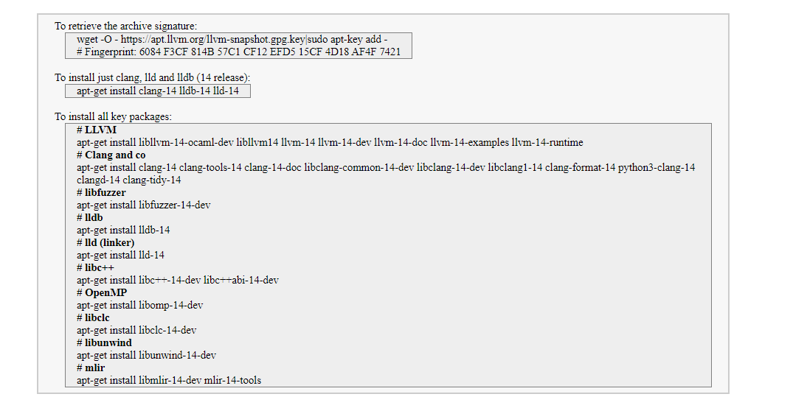

# LLVM-Installation

## Install from ubuntu pkgs
```
sudo apt-get update
sudo apt-get install -y build-essential python3-dev automake cmake git flex bison libglib2.0-dev libpixman-1-dev python3-setuptools cargo libgtk-3-dev
# try to install llvm 14 and install the distro default if that fails
sudo apt-get install -y lld-14 llvm-14 llvm-14-dev clang-14 || sudo apt-get install -y lld llvm llvm-dev clang
```
Details is [here in afl++](https://github.com/AFLplusplus/AFLplusplus/blob/stable/docs/INSTALL.md#linux-on-x86)

## Install following this [super link](https://apt.llvm.org/)
1. Goto [apt.llvm.org/](https://apt.llvm.org/)
2. For 18.04 and llvm-14 you need to add following line in `/etc/apt/sources.list`
```
deb http://apt.llvm.org/bionic/ llvm-toolchain-bionic-14 main
deb-src http://apt.llvm.org/bionic/ llvm-toolchain-bionic-14 main
```

This is for `20.04`,
```
deb http://apt.llvm.org/focal/ llvm-toolchain-focal-14 main
deb-src http://apt.llvm.org/focal/ llvm-toolchain-focal-14 main
```
3. Fetch the key
```
wget -O - https://apt.llvm.org/llvm-snapshot.gpg.key%7Csudo apt-key add -
sudo apt update
```
Tried this key recently but didn't work, so, I tried this one instead,
```
wget -qO- https://apt.llvm.org/llvm-snapshot.gpg.key | sudo tee /etc/apt/trusted.gpg.d/apt.llvm.org.asc
# Fingerprint: 6084 F3CF 814B 57C1 CF12 EFD5 15CF 4D18 AF4F 7421
```

4. Now, run this,
```
sudo apt install clang-14 llvm-14 llvm-14-dev
```
If there is a broken dependency `sudo apt -f install` this will try to fix broken dependencies automatically. If still getting errors, then do this `sudo add-apt-repository ppa:ubuntu-toolchain-r/test`. This is PPA for installing `libstdc++` with C++20 support which is required to install clang-14 (which is mentioned in the doc).  You can read this to understand what is PPA: [askubuntu.com/a/4987](https://askubuntu.com/a/4987)



## Installing latest LLVM by cloning:
```
git clone https://github.com/llvm/llvm-project.git
cd llvm-project
mkdir build
cd build
cmake -G Ninja -DLLVM_ENABLE_RTTI=ON -DLLVM_ENABLE_EH=ON -DBUILD_SHARED_LIBS=ON -DCMAKE_BUILD_TYPE=Release -DLLVM_TARGETS_TO_BUILD=X86 -DLLVM_ENABLE_ASSERTIONS=ON -DLLVM_ENABLE_PROJECTS="llvm;clang" ../llvm
ninja
sudo ninja install 
```

This will install latest LLVM.

After this, make a C file and generate ll file using following cmd,
```/home/raihan/llvm-project/build/bin/clang -O0 -S -emit-llvm input.c -o run.ll```

If -O1 instead of -O0 then it works fine in clang like following,
```clang -O1 -emit-llvm input.c -S -o out.ll``` > can also add -S

Then run this particular opt cmd to run the ll files,
```/home/raihan/llvm-project/build/bin/opt -load /home/raihan/llvm-project/build/lib/LLVMMyHello.so -myhello in.ll```

Run it after disabling new-pass-manager,
```/home/raihan/llvm-project/build/bin/opt -load /home/raihan/llvm-project/build/lib/LLVMMyHello.so -enable-new-pm=0 -myhello in.ll```

2nd Method,

```
git clone https://github.com/llvm/llvm-project.git
mkdir build
cd build
cmake -G Ninja ../llvm -DLLVM_TARGETS_TO_BUILD=X86 -DCMAKE_BUILD_TYPE=Release -DLLVM_ENABLE_PROJECTS=clang
ninja
```


## Installing LLVM-14 or lower version by cloning:
Choose the [llvm-version you want to install.](https://releases.llvm.org/download.html)
Then go to that particular page and download specifically this file which says: `llvm-project-14.0.6.src.tar.xz`

Then just simply go through the general steps like following:
```
cd llvm-project
mkdir build
cd build
cmake -G Ninja -DLLVM_ENABLE_RTTI=ON -DLLVM_ENABLE_EH=ON -DBUILD_SHARED_LIBS=ON -DCMAKE_BUILD_TYPE=Release -DLLVM_TARGETS_TO_BUILD=X86 -DLLVM_ENABLE_ASSERTIONS=ON -DLLVM_ENABLE_PROJECTS="llvm;clang" ../llvm
ninja
```

Now, if you run `sudo ninja install` then it will add it to the path but if there is already another llvm present in path then it will collide with the new llvm.

